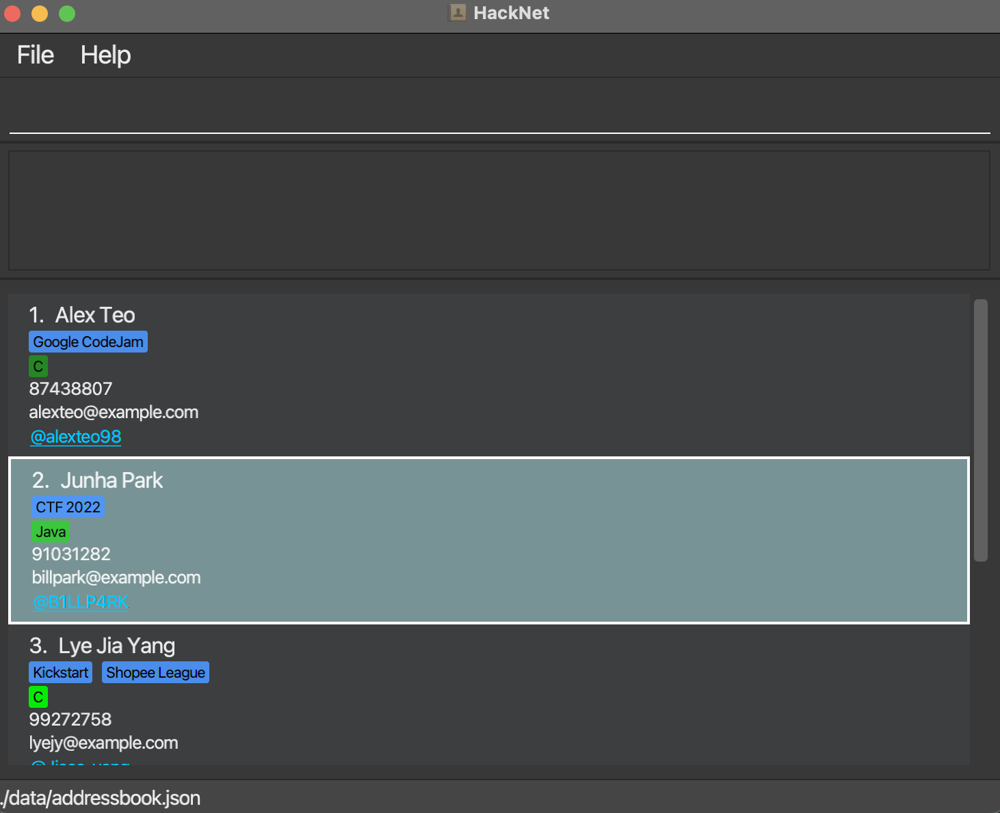
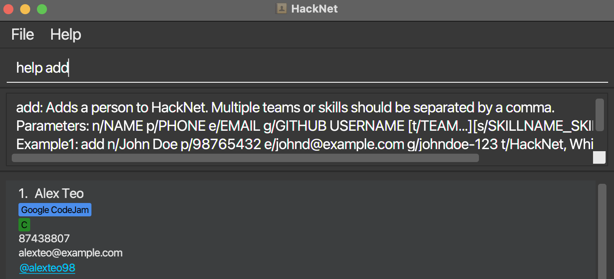
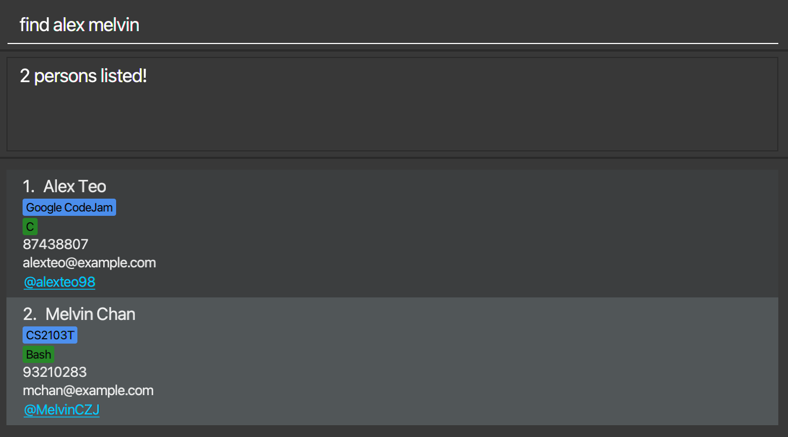
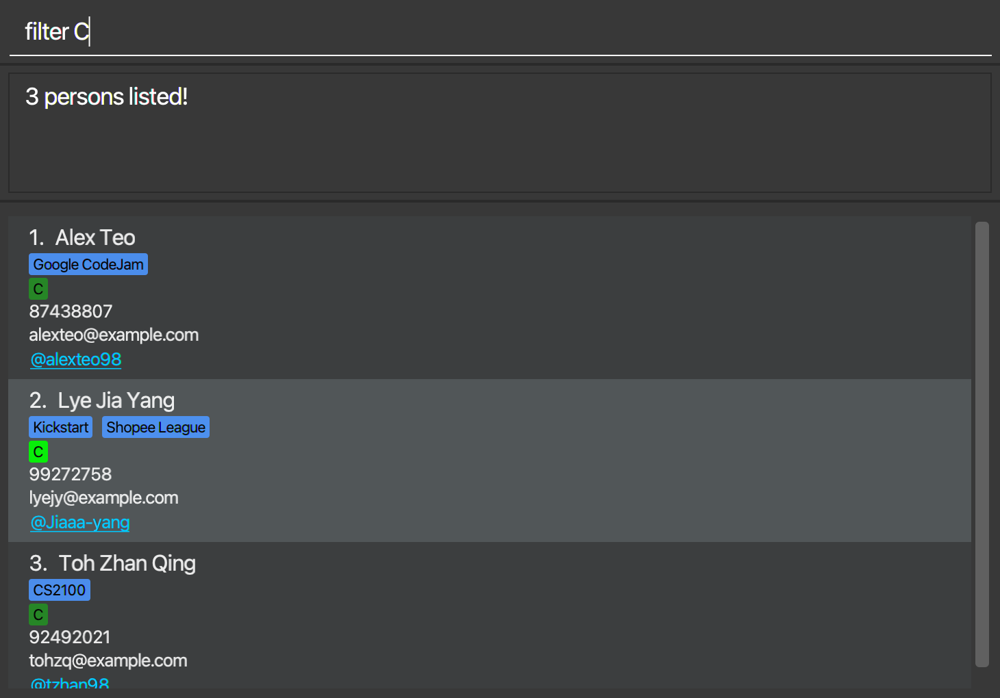
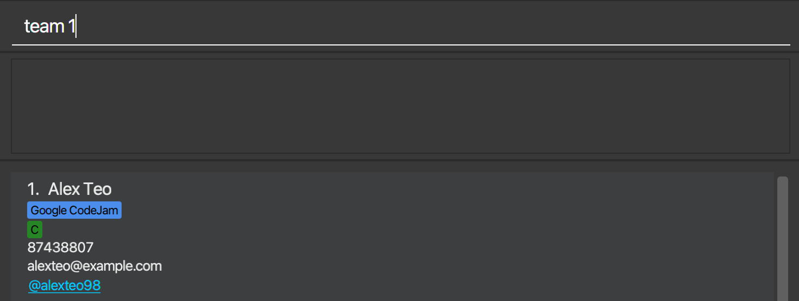

Welcome to the User Guide for **HackNet**, where we will guide you through all you need to know to get started!

**HackNet** is a desktop application that can help you manage contact details of potential team members to work on a technical project or participate in a Hackathon with. It has a simple Graphical User Interface (GUI) which displays details of your potential teammates, and works mainly via a Command Line Interface (CLI) through text commands.

## Table of Contents
* [Quick Start](#quick-start)
* [Features](#features)
    * [Viewing help: help](#viewing-help-help)
    * [Contact Management](#contact-management)
      * [Adding a person: add](#adding-a-person-add)
      * [Editing details for existing contact: edit](#editing-any-number-of-persons-edit)
      * [Add/remove person as potential teammate: team/unteam](#markunmark-contact-as-potential-teammates-teamunteam)
      * [Deleting a person: delete](#deleting-a-person-delete)
      * [Remove all contacts: clear](#clearing-all-entries-clear)
    * [Team Forming](#team-forming)
      * [List all contacts: list](#listing-all-persons-list)
      * [Find person by name: find](#locating-persons-by-name-find)
      * [Filter person by technical skills: filter](#filter-for-past-teammates-filterteam)
      * [Sort person by technical skill: sort](#sorting-persons-by-skill-proficiency-sort)
      * [Show past teammates: filterteam](#filter-for-past-teammates-filterteam)
      * [Show potential teammates: show](#show-all-potential-teammates-show)
    * [Utility](#utility)
      * [Undo](#undo-last-command-undo)
      * [Redo](#redo-last-command-redo)
      * [Navigating User Input History](#navigating-user-input-history--)
    * [Exiting HackNet](#exiting-the-program-exit)
* [Data](#data)
* [FAQ](#faq)
* [Command Summary](#command-summary)

--------------------------------------------------------------------------------------------------------------------

## Quick start

1. Ensure you have Java `11` or above installed in your Computer.

2. Download the latest `HackNet.jar` from [here](https://github.com/AY2122S2-CS2103T-W13-3/tp/releases).

3. Copy the file to the folder you want to use as the _home folder_ for HackNet.

4. Double-click the file to start the app. The GUI similar to the below should appear in a few seconds. Note how the app contains some sample data. 
   

**:information_source: If double-clicking doesn't work:** 

This could be a problem with the Windows OS. You can alternatively start **HackNet** by:
1. Starting a terminal session on your computer
2. Change the directory to the folder containing the file using `cd path/to/HackNet_home_folder`
3. Start HackNet using `java -jar HackNet.jar`

5. Type the command in the command box and press Enter to execute it. e.g. typing **`help`** and pressing Enter will open the help window. 
   Some example commands you can try:

   * **`list`** : Lists all contacts.

   * **`add`**`n/John Doe p/98765432 e/johnd@example.com g/johndoe123` : Adds a contact named `John Doe` to HackNet.

   * **`delete`**` 3` : Deletes the 3rd contact shown in the current list.

   * **`clear`** : Deletes all contacts.

   * **`exit`** : Exits the app.

6. Refer to the [Features](#features) below for details of each command.

--------------------------------------------------------------------------------------------------------------------

## Features

**:information_source: Notes about the command format:** 

* Words in `UPPER_CASE` are the parameters to be supplied by the user. 
    * e.g. in `add n/NAME`, `NAME` is a parameter which can be used as `add n/John Doe`.

* Items in square brackets are optional. 
    * e.g. `n/NAME [t/TEAM]` can be used as `n/John Doe t/friend` or as `n/John Doe`.

* Items with `…`​ after them can have multiple values including 0. 
    * e.g. `[t/TEAM…]​` can be used as ` ` (i.e. 0 times), `t/`, `t/friend, family` etc.

* Parameters can be in any order. 
    * e.g. if the command specifies `n/NAME p/PHONE_NUMBER`, `p/PHONE_NUMBER n/NAME` is also acceptable.

* If a parameter is expected only once in the command but you specified it multiple times, only the last occurrence of the parameter will be taken. 
    * e.g. if you specify `p/12341234 p/56785678`, only `p/56785678` will be taken.

* Extraneous parameters for commands that do not take in parameters (such as `list`, `undo`, `redo`, `exit` and `clear`) will be ignored. 
    * e.g. if the command specifies `list 123`, it will be interpreted as `list`.

* For the team field, maximum length of a team name is 20 characters.

* For skill field, Skill name have to be followed by an underscore `_` and Skill proficiency level that ranges from 0 to 100 with 0 being the lowest proficiency level. Maximum length of a skill name is 10 characters.
    * e.g. `[s/SKILLNAME_SKILLPROFICENCY…]​` as `s/Java_90`

### Viewing help: `help`

Shows a message explaining how to access the help page.

Format: `help [TOPIC]`

Simply calling `help` will bring up a prompt linking to the user guide.

Passing in a relevant keyword as the `TOPIC` parameter such as `add` will bring up a brief description and usage
of the topic.

## Contact Management

This section contains commands that can help you manage the details of your contacts within **HackNet**.

### Adding a person: `add`

Adds a person to HackNet.

Format: `add n/NAME p/PHONE_NUMBER e/EMAIL g/GITHUB_USERNAME [t/TEAM…]​ [s/SKILLNAME_SKILLPROFICENCY…]​`

**:information_source: Notes regarding adding a person:** 

* A person can have any number of teams or skills(including 0) 
* teams and skills in `[t/TEAM…]` and `[s/SKILLNAME_SKILLPROFICENCY…]` must be separated by a comma. The comma can be preceded or followed by any number of whitespaces, which will be ignored. Any excess commas after the last valid value will be ignored. 
* `t/      ` and `s/        ` is treated as `t/` and `s/` as HackNet ignores whitespaces. Therefore, a name of a team cannot be consisting solely of whitespaces. 
* HackNet can store multiple contacts with the same `Name` but will reject inputs that contain any `Email`, `Github Username` or `Phone Number` fields that already exists in HackNet. 
* Consecutive white spaces right after `t/` and `s/` are ignored. 
* A name of a team or skill cannot be consisting solely of whitespaces. 
* Please check that you have correctly entered the skill proficiency level. There is currently no way of viewing the exact number that you entered. You may use the `edit` function to change it if it is wrong.  
* The skill proficiency will only be a visual guide in a shade of green (bright green for high proficiency and dark green for low proficiency). 

Examples:
* `add n/John Doe p/98765432 e/johnd@example.com g/johndoe123`
* `add n/Betsy Crowe e/betsycrowe@example.com g/betsycoder p/1234567 t/gmail plugin, Sublime Text dev s/`

### Editing any number of person(s): `edit`

Edits any number of existing person(s) in HackNet.

Format: `edit INDEX [INDEX…] [-r] [n/NAME] [p/PHONE] [e/EMAIL] [g/GITHUB_USERNAME] [t/TEAM…]​ [s/SKILLNAME_SKILLPROFICENCY…]​`

* Edits the person(s) at the specified `INDEX [INDEX…]`. The index refers to the index number shown in the displayed person list. Indices must be separated by a whitespace as opposed to teams and skills. All index **must be a positive integer** 1, 2, 3, …​
* At least one of the optional fields must be provided besides `[-r]`.
* team and skill values in `[t/TEAM…]` and `[s/SKILLNAME_SKILLPROFICENCY…]` must be separated by a comma. The comma can be preceded or followed by any number of whitespaces, which will be ignored. Any excess commas after the last valid value will be ignored.
* Consecutive white spaces right after `t/` and `s/` are ignored.
* A name of a team or skill cannot be consisting solely of whitespaces.
* Existing values will be updated to the input values.
* In default mode, editing teams appends the new team to the person.
* `-r` option activates reset mode.
* In reset mode, editing teams edits the teams of a person from scratch. i.e adding of teams is not cumulative. You can remove all the person’s teams by typing `t/` without
  specifying any teams after it.
* The concept of default and reset mode applies with skills as well.
* when editing multiple persons, only `[t/TEAM…]` and `[s/SKILLNAME_SKILLPROFICENCY…]` will take effect. Other arguments such as `Name` and `Phone` will be silently ignored.
* HackNet can store multiple contacts with the same `Name` but will reject inputs that contain any `Email`, `Github Username` or `Phone Number` fields that already exists in HackNet.
* When editing multiple persons, only `[t/TEAM…]` and `[s/SKILLNAME_SKILLPROFICENCY…]` will take effect. Other arguments such as `NAME` and `PHONE` will be silently ignored.
* When at least one of the indices provided are invalid for batch edit, HackNet informs that there was an error in the indices, but still delivers the modification for the indices that are valid.
* In the unlikely case that same index is present multiple times for `INDEX [INDEX…]`, HackNet will still successfully execute the edit command as long as the index is valid.

Examples:
* `edit 1 p/91234567 e/johndoe@example.com` Edits the phone number and email address of the 1st person to be `91234567` and `johndoe@example.com` respectively.
* `edit 2 -r n/Betsy Crower t/` Edits the name of the 2nd person to be `Betsy Crower` and clears all existing teams.
* `edit 2 t/HackNet s/` Appends the team `Hacknet` to the 2nd person and keep the current skills.
* `edit 2 3 s/ t/GoogleProject, Hackathon2022` Does not change the skills of 2nd and 3rd person in the list, and appends`GoogleProject` and `Hackathon2022` to the list of teams they belong to.
* `edit 1 2 3 -r s/Java_100, Python_80, t/` Edits the skills of the 1st, 2nd and 3rd person to be `java` and `python` only with proficiency of 100 and 80. The exiting teams are cleared as well.

### Deleting a person: `delete`

Deletes the specified person from HackNet.

Format: `delete INDEX`

* Deletes the person at the specified `INDEX`.
* The index refers to the index number shown in the displayed person list.
* The index **must be a positive integer** 1, 2, 3, …​

Examples:
* `list` followed by `delete 2` deletes the 2nd person in the address book.
* `find Betsy` followed by `delete 1` deletes the 1st person in the results of the `find` command.

### Clearing all entries: `clear`

Clears all existing contacts from HackNet.

Format: `clear`

## Team Forming

This section contains commands that will aid you to find people with the technical skills you need to form your dream team.

### Listing all persons: `list`

Shows a list of all persons in HackNet.

Format: `list`

### Locating persons by name: `find`

Finds persons whose *names* contain any of the given keywords.

Format: `find KEYWORD [MORE_KEYWORDS]`

* The search is case-insensitive. e.g `hans` will match `Hans`
* The order of the keywords does not matter. e.g. `Hans Bo` will match `Bo Hans`
* Only the name is searched.
* Only full words will be matched e.g. `Han` will not match `Hans`
* Persons matching at least one keyword will be returned (i.e. `OR` search).
  e.g. `Hans Bo` will return `Hans Gruber`, `Bo Yang`

Examples:
* `find John` returns `john` and `John Doe`
* `find alex melvin` returns `Alex Teo`, `Melvin Chan` 
  

### Locating persons by skills: `filter`

Finds persons that have the specified skills.

Format: `filter KEYWORD`

* The search is case-insensitive. e.g `java` will match `Java`
* Only full words will be matched e.g. `C` will not match `C#`
* This command accepts multiple skills to be filtered,
e.g. `filter c java` will filter all those with `C` <b><u>AND</u></b> `Java`.

Examples:
* `filter C` returns `Alex Teo`, `Lye Jia Yang` and `Toh Zhan Qing`
* `filter java` returns `Junha Park` 
  

### Sorting persons by skill proficiency: `sort`

Sort persons in descending level of proficiency of specified skill.

Format: `sort SKILL`

* Only persons with the specified `SKILL` will be listed
* The search is case-insensitive. e.g `java` will match `Java`
* Only full words will be matched e.g. `C` will not match `C#`
* The list will be shown in descending level of skill proficiency
* This command only accepts <b><u>ONE</u></b> skill as the sorting criteria.

Examples:
* `sort Python` shows persons with `Python` as a skill in descending order of proficiency

### Mark/unmark contact as potential teammates: `team/unteam`

This feature selects/deselect specified persons as potential members. If a person is selected as a potential teammate,
the contact box will be highlighted in a shade of turquoise.

Format:
* `team INDEX`
* `unteam INDEX`
    * Marks/unmarks the person at `INDEX`as potential teammate
    * The index refers to the index number shown in the displayed person list
    * The index **must be a positive integer** 1, 2, 3, …​

Examples:
* `team 1` marks the first person as a potential teammate

### Filter for past teammates: `filterteam`

Shows a list of past teammates that have been tagged with /t in HackNet.
E.g. `edit INDEX [t/TEAM]` command or `add n/NAME p/PHONE_NUMBER e/EMAIL g/GITHUB_USERNAME [t/TEAM]` command.
Potential teammates marked using the `team` command will **NOT** be shown using the `filterteam` command.

Format: `filterteam`

### Show all potential teammates: `show`

Shows the list of all persons marked as potential teammates

Format: `show`

## Utility

This section contains some commands/shortcuts that can improve your work efficiency in using **HackNet**.

### Undo last command: `undo`

Undo the last command that changes HackNet.  
Only these commands that changed HackNet can be undone:
* Add
* Delete
* Edit
* Team
* Unteam
* Clear

**:information_source: Notes about the undo command:** 

* The commands executed will be stored in history, please use the `undo` command to restore them.
* Only the commands as listed above can be undone.
* If a different command is executed after a command is undone,
the undone command will be removed from history and can no longer be redone.
* e.g `Add person 1 -> Add person 2 -> undo -> Add person 3` will have the same persons and history as
  `Add person 1 ->  Add person 3`
* <b>IMPORTANT!</b> All commands in history will be removed when the application exits.

### Redo last command: `redo`

Redo the command that was previously undone.
Only these commands that changes HackNet can be redone:
* Add
* Delete
* Edit
* Team
* Unteam
* Clear

**:information_source: Notes about the redo command:** 

* This command will revert HackNet back to the state before the last command is executed.
* Only the commands specified above can be redone.
* If a command is executed and there are commands in the history,
those commands that are not redone will be removed from history.
* <b>IMPORTANT!</b> All commands in history will be removed when the application exits.

### Navigating User Input History: `↑`, `↓`

Allows user to quickly retrieve their previous inputs from current session by using the up and down arrow keys.

Format: `↑`, `↓`

### Exiting the program: `exit`

Exits the program.

Format: `exit`

## Data

This section contains information about how we save your data across sessions.

### Saving the data

HackNet data are saved in the hard disk automatically after any command that changes the data. There is no need to save manually.

### Editing the data file

HackNet data are saved as a JSON file `[JAR file location]/data/addressbook.json`. Advanced users are welcome to update data directly by editing that data file.

:exclamation: **Caution:**
If your changes to the data file makes its format invalid, HackNet will discard all data and start with an empty data file at the next run.

### Archiving data files `[coming in v2.0]`

_Details coming soon ..._

--------------------------------------------------------------------------------------------------------------------

## FAQ

**Q**: How do I transfer my data to another Computer? 
**A**: Install the app in the other computer and overwrite the empty data file it creates with the file that contains the data of your previous HackNet home folder.

**Q**: Why does HackNet not show the proficiency of individual's skills? 
**A**: This is because how everyone perceives their own skill proficiency is only a rough gauge and the numbers may not accurately reflect in real life. Therefore, to reduce bias, HackNet distinguishes between different level of skill proficiencies with different hues of green, with brighter green as more proficient in that particular skill.

**Q**: I am colour blind and cannot differentiate between skill proficiency colours. What should I do? 
**A**: You can use the feature `sort` to list out contacts with that particular skill in descending order. (eg. `sort Java`)

**Q**: What is the difference between `list`, `show` and `filterteam`? 
**A**: `list` displays _all_ of your contacts while `show` will only display contacts that you have marked with `team`. Lastly, `filterteam` will display those contacts that you have marked with `/t` (the blue tags)

--------------------------------------------------------------------------------------------------------------------

## Command summary

Action | Format, Examples
--------|------------------
**Help** | `help [TOPIC]`
**Add** | `add n/NAME p/PHONE_NUMBER e/EMAIL g/GITHUB_USERNAME [t/TEAM…]​ [s/SKILLNAME_SKILLPROFICENCY…]​`   e.g., `add n/James Ho p/22224444 e/jamesho@example.com g/jameshooo t/hackathon2021, hackathon2022 s/java_70`
**Edit** | `edit INDEX [INDEX…] [-r] [n/NAME] [p/PHONE] [e/EMAIL] [g/GITHUB_USERNAME] [t/TEAM…]​ [s/SKILLNAME_SKILLPROFICENCY…]​`  e.g.,`edit 2 n/James Lee e/jameslee@example.com`
**Mark/unmark contacts** | `team`, `unteam`   e.g., `team 1`
**Delete** | `delete INDEX`  e.g., `delete 3`
**Clear** | `clear`
**List** | `list`
**Find** | `find KEYWORD [MORE_KEYWORDS]`  e.g., `find James Jake`
**Filter** | `filter SKILL`  e.g. `filter c`
**Sort** | `sort SKILL`  e.g., `sort Python`
**Filter Past Teammates** | `filterteam`
**Show potential teammates** | `show`
**Exit HackNet** | `exit`
**Navigate User Input History** | `↑`, `↓`
